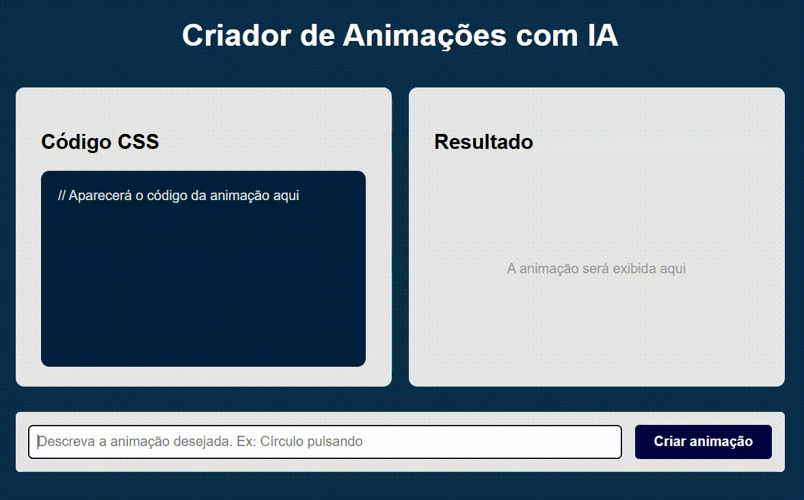
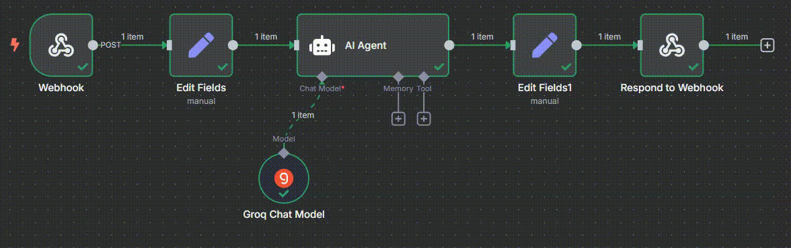

# 🎨 Criador de Animações CSS com IA e n8n

Este projeto demonstra a integração entre uma interface web interativa e uma automação criada na plataforma n8n, que utiliza inteligência artificial para gerar **animações CSS personalizadas** com base em comandos textuais do usuário.

## 📷 Preview



## 🧠 Como Funciona



1. **Usuário descreve a animação** em linguagem natural (ex: "círculo pulsando").
2. A descrição é enviada via webhook para um fluxo no **n8n**.
3. O n8n aplica alguns filtros e depois aciona uma **IA que gera código CSS animado**.
4. O retorno é tratado através do JavaScript e posteriormente exibido na interface praticamente em tempo real.

## 💻 Tecnologias Utilizadas

- **HTML5** e **CSS3** – estrutura e estilo da interface.
- **JavaScript Vanilla** – lógica para envio/recebimento de dados.
- **n8n Cloud** – automação via webhook e processamento de IA.
- **Webhook** – comunicação entre front-end e back-end automatizado.

## 🔍 Detalhes Técnicos

### `scripts.js`

```javascript
let webhook = "https://efrals.app.n8n.cloud/webhook-test/animacao-css";

async function criarAnimacao() {
  let textoInput = document.querySelector(".input-animacao").value;
  let codigo = document.querySelector(".area-codigo");
  let areaResultado = document.querySelector(".area-resultado");
  let botao = document.querySelector(".botao-animacao");

  botao.disabled = true;
  botao.textContent = "Gerando animação...";
  botao.style.cursor = "wait";

  let resposta = await fetch(webhook, {
    method: "POST",
    headers: { "Content-Type": "application/json" },
    body: JSON.stringify({ pergunta: textoInput }),
  });

  let resultado = await resposta.json();
  let info = JSON.parse(resultado.resposta);

  codigo.innerHTML = info.code;
  areaResultado.innerHTML = info.preview;

  document.head.insertAdjacentHTML(
    "beforeend",
    "<style>" + info.style + "</style>"
  );

  botao.disabled = false;
  botao.textContent = "Criar outra animação";
  botao.style.cursor = "pointer";
}
```

### `index.html`

- Título da página
- Área de **código CSS gerado**
- Área de **resultado visual da animação**
- Campo de entrada de texto e botão para acionar a geração via IA

### `styles.css`

Design moderno, responsivo e amigável. Cores contrastantes, elementos bem espaçados e estilo visual agradável para desenvolvedores e usuários.

## 📷 Exemplo de Retorno do n8n

```json
{
"output":
"{\n "code": "<span class='selector'>.pulsante</span> { <span class='property'>width</span>: <span class='value'>100px</span>; <span class='property'>height</span>: <span class='value'>100px</span>; <span class='property'>background</span>: <span class='value'>#ff69b4</span>; <span class='property'>border-radius</span>: <span class='value'>50%</span>; <span class='property'>animation</span>: <span class='value'>pulsar 1s infinite</span>; }\n<span class='selector'>@keyframes</span> <span class='value'>pulsar</span>\n{ <span class='property'>0%</span> { <span class='property'>transform</span>: <span\nclass='value'>scale(1)</span>; } <span class='property'>50%</span> { <span\nclass='property'>transform</span>: <span class='value'>scale(1.2)</span>; }\n<span class='property'>100%</span> { <span class='property'>transform</span>:\n<span class='value'>scale(1)</span>; } }",\n "preview": "<div class='pulsante'></div>",\n "style": ".pulsante { width: 100px; height: 100px; background: #ff69b4; border-radius: 50%; animation: pulsar 1s infinite; } @keyframes pulsar { 0% { transform: scale(1); } 50% { transform: scale(1.2); } 100% { transform: scale(1); } }"\n}"
}
```
